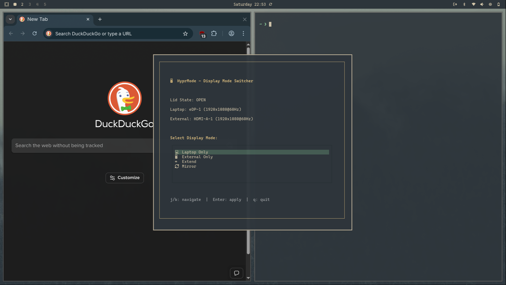

# hyprmode

**Windows Super+P style display mode switcher for Hyprland**

A fast, minimal TUI tool for switching display modes on Hyprland. Switch between laptop-only, external-only, extend, and mirror modes with a single keypress—just like Windows Super+P.




---

## Quick Install & Setup

Get HyprMode running in 5 minutes. Follow these steps in order:

### Step 1: Install HyprMode

#### Option A: Install via AUR (Recommended)

```bash
yay -S hyprmode
```

#### Option B: Manual Installation

```bash
# Clone the repository
git clone https://github.com/Zeus-Deus/hyprmode.git
cd hyprmode

# Run the installer
chmod +x install.sh
./install.sh
```

The installer will set up both the main tool and the emergency recovery daemon (prevents black screens when unplugging monitors).

**Dependencies (Arch Linux):**

```bash
sudo pacman -S python-textual
```

### Step 2: Add Keybinding to Hyprland

Add this keybinding to launch HyprMode with **SUPER+SHIFT+P**:

**For Omarchy users (< 3.2 with Alacritty):**

```bash
echo 'bindd = SUPER SHIFT, P, Display switcher, exec, alacritty --class hyprmode -e hyprmode' >> ~/.config/hypr/bindings.conf
```

**For Omarchy users (>= 3.2 with Ghostty):**

```bash
echo 'bindd = SUPER SHIFT, P, Display switcher, exec, ghostty --title=hyprmode -e hyprmode' >> ~/.config/hypr/bindings.conf
```

**For standard Hyprland users (Kitty):**

```bash
echo 'bind = SUPER SHIFT, P, exec, kitty --class hyprmode -e hyprmode' >> ~/.config/hypr/hyprland.conf
```

**For Foot users:**

```bash
echo 'bind = SUPER SHIFT, P, exec, foot --app-id=hyprmode hyprmode' >> ~/.config/hypr/hyprland.conf
```

> **Note:** The `--class`, `--title`, or `--app-id` flag is required so Hyprland can identify the HyprMode window and apply the floating/centering rules. Choose the command that matches your terminal. Ghostty requires `--title` instead of `--class`.

### Step 3: Add Window Rules

HyprMode needs to float and center on your screen. Choose the rules that match your terminal:

**For Ghostty users:**

```bash
cat >> ~/.config/hypr/windows.conf << 'EOF'

# HyprMode - Float and center (for Ghostty terminal)
windowrulev2 = float, title:(hyprmode)
windowrulev2 = center, title:(hyprmode)
windowrulev2 = size 600 530, title:(hyprmode)
windowrulev2 = opacity 0.95, title:(hyprmode)
EOF
```

**For Alacritty/Kitty users:**

```bash
cat >> ~/.config/hypr/windows.conf << 'EOF'

# HyprMode - Float and center (for Alacritty/Kitty)
windowrulev2 = float, class:(hyprmode)
windowrulev2 = center, class:(hyprmode)
windowrulev2 = size 600 530, class:(hyprmode)
windowrulev2 = opacity 0.95, class:(hyprmode)
EOF
```

**For Foot users:**

```bash
cat >> ~/.config/hypr/windows.conf << 'EOF'

# HyprMode - Float and center (for Foot terminal)
windowrulev2 = float, app-id:(hyprmode)
windowrulev2 = center, app-id:(hyprmode)
windowrulev2 = size 600 530, app-id:(hyprmode)
windowrulev2 = opacity 0.95, app-id:(hyprmode)
EOF
```

> **Note:** Ghostty uses `title:` matching, Alacritty/Kitty use `class:` matching, and Foot uses `app-id:` matching. Make sure to use the correct window rules for your terminal.

**For Omarchy users only** - ensure `windows.conf` is sourced in your main config:

```bash
# Check if already sourced
if ! grep -q "windows.conf" ~/.config/hypr/hyprland.conf; then
    echo "source = ~/.config/hypr/windows.conf" >> ~/.config/hypr/hyprland.conf
fi
```

### Step 4: Enable Daemon Autostart

The emergency recovery daemon prevents black screens when you unplug monitors. Enable it to start automatically:

```bash
systemctl --user enable hyprmode-daemon.service
systemctl --user start hyprmode-daemon.service
```

### Step 5: Reload Hyprland

Apply all the changes:

```bash
hyprctl reload
```

### Step 6: Test Your Setup

Test that HyprMode launches correctly:

Press **SUPER+SHIFT+P** to confirm the keybinding works.

You should see a centered floating window with display mode options. Use `j`/`k` or arrow keys to navigate, `Enter` to select, and `q` to quit.

**If it doesn't work:** See the [Troubleshooting](#troubleshooting) section below.

---

> **✅ Setup Complete!** Press **SUPER+SHIFT+P** anytime to switch display modes.
>
> For advanced configuration, technical details, and troubleshooting, see the sections below.

---

## What Does HyprMode Do?

HyprMode gives you four display modes, just like Windows Super+P:

1. **💻 Laptop Only** - Only your laptop screen is active (external displays disabled)
2. **🖥️ External Only** - Only external monitor is active (laptop screen disabled)
3. **↔️ Extend** - Both displays active, external positioned to the right
4. **🔄 Mirror** - Both displays show identical content

### Why You Need This

- **Fast switching** - Change display modes in under a second
- **Emergency recovery** - Daemon automatically restores your laptop screen if all monitors disconnect
- **Lid-aware** - Automatically handles laptop lid open/close events
- **Beautiful TUI** - Clean interface with vim keybindings
- **Theme support** - Auto-detects Omarchy themes

---

## Usage

### Manual Mode

Run `hyprmode` from terminal or press **SUPER+SHIFT+P**:

```bash
hyprmode
```

**Navigation:**
- `j` / `Down` - Move down
- `k` / `Up` - Move up
- `Enter` - Apply selected mode
- `q` - Quit

### Emergency Recovery Daemon

The daemon runs in the background and monitors for monitor disconnections. If you're in "External Only" mode and unplug your HDMI cable, the daemon automatically restores your laptop screen within 1 second.

**Check daemon status:**

```bash
systemctl --user status hyprmode-daemon
```

**View live logs:**

```bash
journalctl --user -u hyprmode-daemon -f
```

You should see `HEARTBEAT` messages every second, confirming the daemon is monitoring.

---

## Advanced Configuration

### Customizing Window Size

The default HyprMode window is 600x530 pixels. To change it:

```bash
nano ~/.config/hypr/windows.conf  # or hyprland.conf
```

Change the size line (use the matching type for your terminal):

```conf
# For Alacritty/Kitty
windowrulev2 = size 600 530, class:(hyprmode)  # Default
windowrulev2 = size 550 400, class:(hyprmode)  # Smaller
windowrulev2 = size 700 600, class:(hyprmode)  # Larger

# For Ghostty
windowrulev2 = size 600 530, title:(hyprmode)  # Default
windowrulev2 = size 550 400, title:(hyprmode)  # Smaller
windowrulev2 = size 700 600, title:(hyprmode)  # Larger

# For Foot
windowrulev2 = size 600 530, app-id:(hyprmode)  # Default
windowrulev2 = size 550 400, app-id:(hyprmode)  # Smaller
windowrulev2 = size 700 600, app-id:(hyprmode)  # Larger
```

Then reload: `hyprctl reload`

### Using a Different Keybinding

Don't like **SUPER+SHIFT+P**? You can use any key combination. Just edit your binding:

**Example with SUPER+P (no shift) - Alacritty:**

```conf
bind = SUPER, P, exec, alacritty --class hyprmode -e hyprmode
```

**Example with SUPER+P (no shift) - Ghostty:**

```conf
bind = SUPER, P, exec, ghostty --title=hyprmode -e hyprmode
```

**Example with SUPER+D - Alacritty:**

```conf
bind = SUPER, D, exec, alacritty --class hyprmode -e hyprmode
```

**Example with SUPER+D - Ghostty:**

```conf
bind = SUPER, D, exec, ghostty --title=hyprmode -e hyprmode
```

### Automatic Lid Handling

The installer auto-detects your laptop monitor and creates `~/.config/hypr/lid-switch.conf` with lid event bindings:

```conf
# When lid closes - disable laptop display
bindl = , switch:on:Lid Switch, exec, hyprctl keyword monitor "eDP-2,disable"

# When lid opens - restore laptop display
bindl = , switch:off:Lid Switch, exec, hyprctl keyword monitor "eDP-2,1920x1200@165,auto,1.25"
```

This uses Hyprland's native `bindl` (bind lid switch) feature for instant, zero-CPU-overhead detection. The installer automatically detects your laptop monitor name (eDP-1, eDP-2, etc.) and resolution.

After installation, reload Hyprland: `hyprctl reload`

### Dynamic Terminal Helper (For Advanced Users)

If you're creating wrapper scripts or want to auto-detect the terminal, use this helper function:

```python
def build_terminal_command():
    import os

    terminal = os.environ.get("TERMINAL", "alacritty").lower()
    flags = {
        "alacritty": "--class hyprmode -e",
        "ghostty": "--title=hyprmode -e",
        "kitty": "--class hyprmode -e",
        "foot": "--app-id=hyprmode",
    }
    flag = flags.get(terminal, "-e")
    return f"{terminal} {flag} hyprmode"
```

This automatically selects the correct `--class`, `--title`, or `--app-id` flag based on your `$TERMINAL` environment variable.

---

## Troubleshooting

### HyprMode window doesn't float or center

**Problem:** The window opens but isn't floating/centered.

**Solution:** Make sure you added the window rules and reloaded Hyprland:

```bash
hyprctl reload
```

Verify the rules are loaded:

```bash
hyprctl getoption windowrulev2 | grep hyprmode
```

### "hyprctl not found" error

**Problem:** HyprMode can't find `hyprctl`.

**Solution:** Make sure you're running Hyprland (not X11/other Wayland compositors). HyprMode only works on Hyprland.

### "No monitors detected" error

**Problem:** HyprMode can't detect your displays.

**Solution:** Check that Hyprland sees your monitors:

```bash
hyprctl monitors -j
```

If this command fails, Hyprland isn't running or has an issue.

### Keybinding doesn't work

**Problem:** Pressing **SUPER+SHIFT+P** does nothing.

**Solution:**

1. Verify the binding was added:

```bash
grep -i "hyprmode" ~/.config/hypr/bindings.conf ~/.config/hypr/hyprland.conf
```

2. Make sure you reloaded Hyprland after adding the binding:

```bash
hyprctl reload
```

3. Test if HyprMode works from terminal:

```bash
hyprmode
```

If it works from terminal but not from the keybind, check your terminal's executable name matches the command.

### Daemon not starting after reboot

**Problem:** Emergency recovery daemon isn't running.

**Solution:**

1. Check daemon status:

```bash
systemctl --user status hyprmode-daemon
```

2. If it shows "failed", check logs:

```bash
journalctl --user -u hyprmode-daemon -n 50
```

3. Verify daemon is enabled:

```bash
systemctl --user is-enabled hyprmode-daemon
```

4. If disabled, enable it:

```bash
systemctl --user enable hyprmode-daemon
systemctl --user start hyprmode-daemon
```

### Emergency recovery not working

**Problem:** Unplugging HDMI in "External Only" mode doesn't restore laptop screen.

**Solution:**

1. Verify daemon is running and monitoring:

```bash
journalctl --user -u hyprmode-daemon -f
```

You should see `HEARTBEAT` messages every second.

2. If no heartbeat, restart the daemon:

```bash
systemctl --user restart hyprmode-daemon
```

3. Test emergency recovery:
   - Plug in external monitor
   - Run `hyprmode` and switch to "External Only"
   - Unplug HDMI cable
   - Laptop screen should restore within 1 second

4. Check logs for emergency event:

```bash
journalctl --user -u hyprmode-daemon | grep "EMERGENCY"
```

Expected output:

```
⚠️ EMERGENCY: No active monitors detected!
✓ Emergency recovery executed
```

### Laptop screen still shows artifacts in "External Only" mode

**Problem:** Laptop screen is "disabled" but still shows some display output.

**Solution:** This is a display driver issue, not a HyprMode issue. The monitor is properly disabled in Hyprland. Some laptop displays show residual artifacts when disabled—this is normal hardware behavior.

### Multiple external monitors

**Problem:** I have 2+ external monitors and HyprMode only uses one.

**Solution:** HyprMode currently uses the first detected external monitor. Multi-monitor support may be added in the future. For now, you can manually configure additional monitors using `hyprctl`.

### Version mismatch after update

**Problem:** Daemon shows wrong version or old code is running.

**Solution:** Force a clean reinstall:

```bash
cd ~/Documents/hyprmode  # or wherever you cloned it

# Complete uninstall
./uninstall.sh

# Clean Python bytecode cache
sudo find /usr/local/bin -name "*.pyc" -delete
find ~/.cache -name "*hyprmode*.pyc" -delete

# Reinstall
./install.sh

# Verify correct version
journalctl --user -u hyprmode-daemon | grep "VERSION"
```

---

## 🔍 Technical Details

### Components

HyprMode consists of two tools:

1. **hyprmode** - Interactive TUI for switching display modes
2. **hyprmode-daemon** - Emergency recovery daemon that monitors for monitor disconnections

Both are installed together and work seamlessly.

### Monitor Detection

- Uses `hyprctl monitors all -j` to detect all monitors (including disabled ones)
- Falls back to `hyprctl monitors -j` for older Hyprland versions
- Identifies laptop display by "eDP" in monitor name
- Handles multiple external monitors (uses first detected)

### Display Commands

HyprMode uses these `hyprctl` commands internally:

```bash
# Disable monitor
hyprctl keyword monitor "MONITOR_NAME,disable"

# Enable with auto-detection
hyprctl keyword monitor "MONITOR_NAME,preferred,auto,1"

# Extend mode
hyprctl keyword monitor "LAPTOP,preferred,0x0,1"
hyprctl keyword monitor "EXTERNAL,preferred,auto-right,1"

# Mirror mode
hyprctl keyword monitor "EXTERNAL,WIDTHxHEIGHT@REFRESH,0x0,1,mirror,LAPTOP"
```

### Daemon Technical Details

**Monitor Detection Method:**
- Uses `hyprctl monitors -j` with `dpmsStatus` field
- Checks if display is actually powered on (`dpmsStatus == True`)
- More reliable than the `disabled` field

**Startup Behavior:**
- Waits up to 30 seconds for Hyprland to be ready
- Auto-retries via systemd if first attempt fails
- Typical success on 2nd attempt (6 seconds after boot)

**Performance:**
- Polls every 1 second (negligible CPU usage)
- Memory footprint: ~6-7MB
- Response time: < 1 second for emergency recovery

**Safety Features:**
- Python bytecode caching bypass (prevents stale code)
- Version tracking (verify correct code is running)
- Comprehensive error logging
- Automatic systemd restart on failure

### Files Installed

- `/usr/local/bin/hyprmode` - Main TUI tool
- `/usr/local/bin/hyprmode-daemon` - Emergency recovery daemon
- `/usr/local/bin/hyprmode-daemon-wrapper` - Python wrapper script
- `~/.config/systemd/user/hyprmode-daemon.service` - Systemd service
- `~/.config/hypr/lid-switch.conf` - Automatic lid handling config (created by installer)

---

## Development

### Running from Source

```bash
# Manual mode
python hyprmode.py

# Daemon mode
python hyprmode-daemon.py
```

### Project Structure

```
hyprmode/
├── hyprmode.py              # Main TUI application
├── hyprmode-daemon.py       # Emergency recovery daemon
├── hyprmode-daemon-wrapper  # Daemon wrapper script
├── hyprmode-daemon.service  # Systemd service unit
├── install.sh               # Installation script
├── uninstall.sh             # Uninstallation script
├── README.md                # This file
└── LICENSE                  # MIT License
```

### Debugging Commands

**Check Hyprland monitor state:**

```bash
# View all monitors (including disabled)
hyprctl monitors all -j | jq

# View only active monitors
hyprctl monitors -j | jq

# Check specific monitor's dpmsStatus
hyprctl monitors -j | jq '.[] | {name, dpmsStatus, disabled}'
```

**Monitor daemon in real-time:**

```bash
# Follow daemon logs live
journalctl --user -u hyprmode-daemon -f

# Show last 100 lines
journalctl --user -u hyprmode-daemon -n 100

# Show logs from specific time
journalctl --user -u hyprmode-daemon --since "5 minutes ago"

# Show only emergency events
journalctl --user -u hyprmode-daemon | grep "EMERGENCY"
```

**Verify installation:**

```bash
# Check all installed files exist
ls -la /usr/local/bin/hyprmode*
ls -la ~/.config/systemd/user/hyprmode-daemon.service

# Verify service is enabled
systemctl --user is-enabled hyprmode-daemon

# Check what systemd is actually executing
systemctl --user show hyprmode-daemon | grep ExecStart
```

### Understanding Daemon Logs

**Normal operation (healthy daemon):**

```
✓ Hyprland is ready
HyprMode Daemon VERSION: 2025-10-19-PRODUCTION-v1
hyprmode emergency recovery daemon started
Monitoring for external display disconnect...
HEARTBEAT
Detected: 2 monitors, has_laptop=True
```

**First boot attempt (normal behavior):**

```
Waiting for Hyprland to start...
ERROR: Hyprland failed to start after 30 seconds
hyprmode-daemon.service: Failed with result 'exit-code'.
Scheduled restart job, restart counter is at 1.
```

This is **expected** on boot - systemd automatically retries and succeeds.

**Emergency recovery in action:**

```
Detected: 1 monitors, has_laptop=False     # External Only mode
Detected: 0 monitors, has_laptop=False     # HDMI unplugged!
⚠️ EMERGENCY: No active monitors detected!
✓ Emergency recovery executed
Detected: 1 monitors, has_laptop=True      # Laptop restored
```

---

## Uninstallation

To remove HyprMode completely:

```bash
cd ~/Documents/hyprmode  # or wherever you cloned it
chmod +x uninstall.sh
./uninstall.sh
```

This removes all installed files and disables the daemon service.

---

## Contributing

Contributions welcome! Please:

1. Fork the repository
2. Create a feature branch
3. Make your changes
4. Submit a pull request

---

## License

MIT License - see LICENSE file for details

---

## Credits

- Built with [Textual](https://textual.textualize.io/) TUI framework
- Inspired by Windows Super+P functionality
- Made for [Hyprland](https://hyprland.org/) Wayland compositor

---

## Links

- **Repository**: https://github.com/Zeus-Deus/hyprmode
- **Issues**: https://github.com/Zeus-Deus/hyprmode/issues
- **Hyprland**: https://hyprland.org/
- **Textual**: https://textual.textualize.io/
